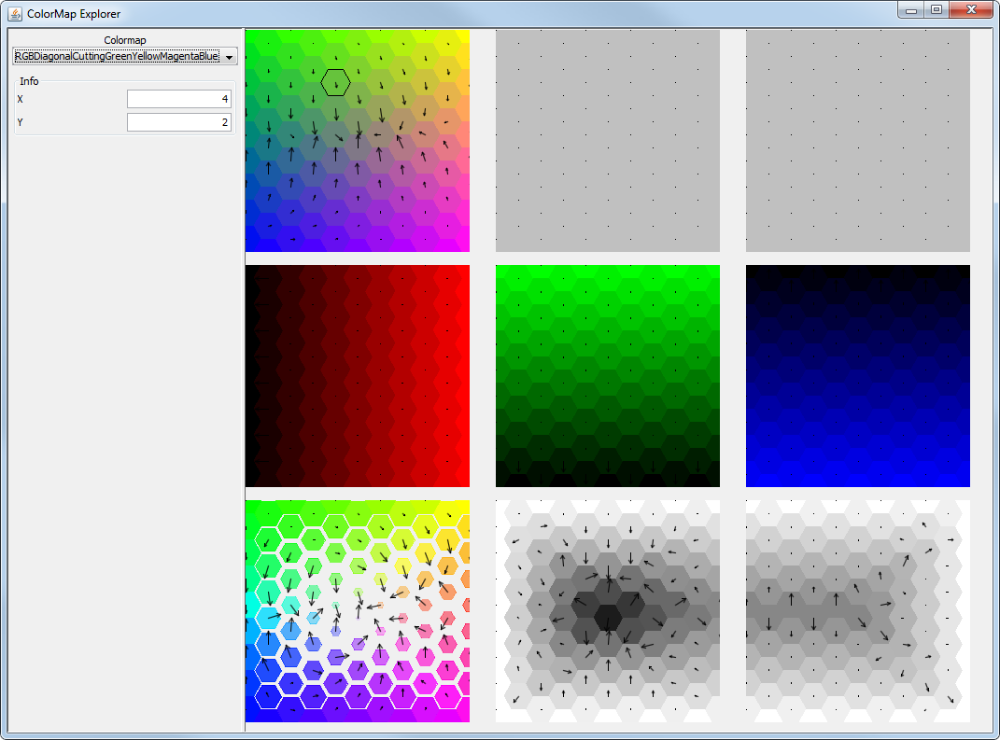

#ColorMap Explorer
**A tool for exploring 2D colormaps**

### Overview

This tool gives an overview on different colormaps by separating them into different filtered views.
The vector field indicates the distance between adjacent tiles, measured in delta E distance in CAM02-UCS 
as published in "Uniform Colour Spaces Based on CIECAM02 Colour Appearance Model" (Luo et al).

The size of the tiles in the *hue*-filtered view at the bottom left corner indicates the amount of saturation.

### Setup

You can run the tool in the command line using

    gradlew run
	
You can create project files for eclipse and IntelliJ using

    gradlew eclipse
	gradlew idea

### License

This module is licensed under the [Apache 2.0 License](http://www.apache.org/licenses/LICENSE-2.0.html).